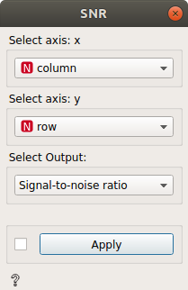
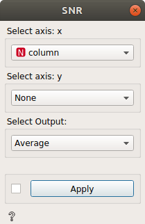
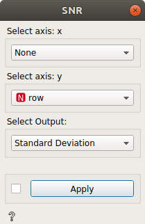

SNR
===============

Signal-to-Noise Ratio (SNR)

**Inputs**

- Data: input dataset

**Outputs**

- Signal-to-noise ratio: signal-to-noise ratio dataset
    - *SNR = \\(\frac{\overline{Spectra_{x, y}}}{\sigma _{x, y}}\\)*
- Averages: averaged dataset
    - *Averages = \\(\overline{Spectra_{x, y}}\\)*
- Standart Deviation: standart deviation dataset
    - *Standart Deviation = \\(\sigma _{x, y}\\)*

The **SNR** widget enables you to calculate de SNR, average or standart deviation spectra. It can output the results of a entire dataset or by coordinates (x, y).

------------
Use *Select axis: x* select an axis that will act as a first element for your coordinate system defined byNumeric meta.

Use *Select axis: y* Select an axis that will act as a second element for your coordinate system defined by a Numeric meta.

In the example above, the end result will be:

**output = Signal-to-noise ratio(column, row)**

*SNR = \\(\frac{\overline{Spectra_{column, row}}}{\sigma _{column, row}}\\)*
________________

If you want to select only one axis:

**output = Average(x)**

*Average = \\(\overline{Spectra_{column}}\\)*
 
 or
 
 

**output = Standart Deviation(x)**

*Standart Deviation = \\(\sigma _{column}\\)*
___________

If you want the result of the complete data set, you can just leave both as None.